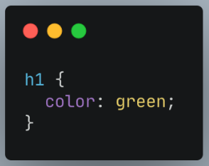

# **Unix Comand Line**

Command line dapat dikatakan sebagai mekanisme yang digunakan untuk berinteraksi dengan system operasi atau perangkat computer. Interface yang digunakan disebut juga sebagai cli atau command line interface. Pada CLI untuk dapat melakukan interaksi menggunakan perinta-perintah atau sintak khusus yang dapat dimengerti oleh system operasi. Berbeda dengan GUI yang berupa tampilan yang cukup nyaman, CLI hanya berisikan baris teks command

### **Shell**
Shell adalah program perintah yang digunakan untuk dapat menerima perintah yang diketikkan dari keyboard yang kemudian perintah tersebut dikirim ke system operasi dan akan langsung dieksekusi.
Shell biasa digunakan pada linux, namun seiring perkembangan zaman linux sudah menerapkan tampilan GUI

### **Terminal**
Terminal adalah program yang digunakan untuk menjalankan shell itu sendiri, pada windows sendiri terminal yang dapat digunakan adalaha cmd atau command prompt

Perintah-perintah Command Line
Terdapat beberapa perintah yang dapat digunakan sebagai berikut:
- Ls : list files
- Ls –la : list all file baik yang terhidden
- Pwd : mengetahui posisi saat ini
- Cd : berpindah folder atau directory
- Mkdir : membuat folder atau directory
- Rm dan rm -r : menghapus file dan menghapus folder
- Touch : membuat file baru
- Cp or cp -r: salin file atau salin folder
- Mv : menghapus file

Contoh:
	

 


# **Git & Git Hub**
Git adalah version control system atau tools yang biasa digunakan oleh para developer untuk dapat memudahkan dalam melakukan kolaborasi project maupun pengembangan software secara bersamaan. Git juga digunakan untuk menyimpan file pemrograman.

Fungsi utama dari git sendiri adalah mengatur versi source code program mencatat setiap perubahan pada File ataupun folder (termasuk code yang kita buat) pada suatu proyek baik dikerjakan secara individu maupun tim.

### **Git Hub**
Github sendiri adalah sebuah platform yang memungkinkan seseorang ataupun tim untuk meyimpan dan mengunduh sebuah project dimana project tersebut dapat dibuat dan dikerjakan secara kolaborasi ataupun bersama-sama. Tidak hanya Github terdapat juga beberapa platform yang memiliki fungi yang sama seperti Gitlab dan BitBucket.

### **Requirement GIt**
-	Install GIT (https://git-scm.com)
-	Membuat akun Github (https://github.com)
-	Download Github Desktop (https://desktop.github.com)

### **Sintak atau perintah:**
-	GIT init ini untuk membuat sebuah repository yang berada pada file lokal dimana nantinya file tersebut bernama .git. 
-	GIT status ini untuk mengetahui status dari sebuah repository lokal. 
-	GIT add ini untuk menambahkan file baru yang ada pada repository yang telah dipilih. 
-	GIT commit ini untuk menyimpan perubahan yang telah dilakukan. 
-	GIT push ini digunakan untuk mengirimkan perubahan file setelah di commit ke remote repository. 
-	GIT branch ini melihat seluruh branch yang ada dalam repository. 
-	GIT checkout ini dapat menukar branch yang aktif dengan branch yang telah dipilih. 
-	GIT merge ini untuk menggabungkan branch yang aktif dan yang telah dipilih. 
-	GIT clone ini dapat membuat salinan repository lokal.

### **Istilah Git**
1. Repository 	: Folder atau direktori yang isinya adalah file dan riwayat perubahan kode project.
2. Commit	 	: Rekaman riwayat perubahan pada file, meliputi siapa, apa, dan kapan perubahan terjadi.
3. Clone 		: Salinan repository orang lain ke Github dan bisa diedit secara offline.
Remote		: Versi respiratory yang disimpan di server Github. Bisa dilakukan sinkronisasi dengan versi 
clone sehingga perubahan offline juga tetap tercatat.
4. Branch		: Disebut juga dengan cabang dari repository utama. Di branch, kode yang digunakan bisa diotak-atik untuk memperbaiki bug. 
5. Merge		: Penggabungan kode yang sudah diubah pada suatu branch ke respiratory lainnya. 
6. Pull request	: Bisa mengusulkan suatu perubahan pada repository ke pemilik/pemimpin project. 
7. Issue		: Berisi saran, pertanyaan atau permintaan yang berhubungan dengan repository.


# **HTML**
Html atau hyper text markup language merupakan kerangka atau struktur yang digunakana untuk membuat  struktur halaman website.


# **Struktur HTML**


Tool pendukung
-	Code editor
-	Browser (chrome)

### **Tag HTML**
Tag adalah tanda awalan dan akhiran dalam perintah HTML yang akan dibaca oleh web browser. Tag dibuat dengan menggunakan kurung siku <…>, di mana di dalamnya berisi nama tag
```
<html>		: Untuk memulai membuat halaman HTML 
              yang mencakup semua konten dan    
              elemen. 
<head>		: Untuk membuat halaman HTML yang 
              mencakup tampilan deskripsi di 
              hasil pencarian 
 Google, style konten (CSS), dan lainnya.  
<title>		: Untuk membuat judul website 
<body>		: Untuk membuat bagian isi website
<h1>  - <h6> 	: Untuk membuat bagian heading pada artikel 
<p> 		: Untuk membuat paragraf 
<!– –> 		: Untuk membuat komentar
```
### **Comment HTML**
Komentar adalah elemen yang akan diabaikan oleh browser. Ia tidak akan ditampilkan di dalam web. Komentar biasanya digunakan untuk memberikan informasi tambahan pada kode HTML
Contoh : <! -- and end with -->


### **Elemen**
Elemen merupakan komponen HTML yang berupa keseluruhan kode dari tag pembuka hingga tag penutup.
```
Contohnya: <h1>Belajar HTML</h1>. 
```

### **Atribut**
Atribut adalah informasi atau perintah tambahan yang berada dalam elemen. Atribut ini berfungsi sebagai penjelas perintah tag pada elemen.
Misalnya, . 
Tag  memiliki atribut khusus yaitu (scr) yang artinya browser harus menampilkan gambar.jpg 

### **Semantic HTML**
semantic HTML adalah elemen atau tag yang memiliki sebuah arti, elemen semantik dengan jelas
Salah satu keuntungan menggunakan elemen semantik adalah dokumen HTML kita akan mudah dibaca, baik itu oleh manusia maupun mesin.
```
Misalnya tag <footer>, tag ini digunakan untuk membuat elemen footer atau bagian kaki dari web.
```

### **Deployment**
Merupakan sebuah cara atau proses dalam mempublish web yang sudah dibuat agar dapat dilihat dan digunakan oleh orang-orang
Tool : Netlify
**How to deploy:**
masuk ke netlify.com lalu register seperti biasa menggunakan email atau github
Setelah itu masuk ke tab Sites lalu drag and drop seluruh folder html kalian

# **CSS**
CSS atau cascade style sheet merupakan bahasa computer yang digunakan untuk memperindah mendesign suatu halaman html. CSS juga dapat dikatakan sebagai baju ataupun decorator yang memberi warna dan layout pada website.

### **Adapun tiga cara menulis CSS di HTML:**

Internal CSS –> ditulis di dalam tag `<style>`

Contoh:
 
Inline CSS –> ditulis di atribut elemen HTML
Contoh: 
 
External CSS –> ditulis di file CSS terpisah dengan HTML
Contoh:

### **Comment**
Merupakan catatan yg disisipkan untuk memudahkan baca code yang telah dibuat
Contoh: /* --- */


### **4 Cara styling css**
- Tag name : menggunakan element html secara langsung pada css, tag name bersifat global
 
- Class : menggunakan atribut class pada element html dan memanggil nama class 

-	ID : Bersifat unik dimana hanya ada 1 nama ID pada element html

- !important : Bersifat prioritas dan utama


### **Flexbox**
Merupakan layout yang digunakan untuk mengatur elemen pada halaman web seperti mengatur panjang, lebar dan posisi item-item yang ada di dalamnya agar memaksimalkan ruang yang ada.

### **Property flexbox**

**flex-direction**
Menentukkan arah (direction) yang akan diberlakukan untuk item-item yang ada pada container flexbox. Arah yang dimaksud adalah apakah ingin mengarah berbaris/horizontal (dari kiri ke kanan atau sebaliknya) atau seperti kolom/vertikal (dari atas kebawah atau sebaliknya)

**justify-content**
justify-content digunakan untuk mensejajarkan item-item diantara flexbox agar container dari flexbox tersebut bisa mendistribusikan ruang kosong yang tersisa ketika item flex dalam satu baris tersebut tidak flexsibel atau meskipun flexsibel tapi sudah mencapai batas ukuran maksimum.
flex-start | flex-end | center | space-between | space-arround | baseline

# **Algoritma**
Algoritma adalah deskripsi dari tahapan atau langkah-langkah yang digunakan untuk menyelesaikan suatu masalah yang ada.

### **3 hal syarat algortima**
-	Input dan input di definisikan dengan tepat
-	Setiap step harus jelas dan tidak memingungkan
-	Tidak mengandung suatu code bahasa pemrograman 

### **Pseudocode**
Adalah cara penulisan urutan  logika program secara informal atau dibuat  dengan kaidah tersendiri dengan tujuan untuk mudah di pahami oleh manusia
Contoh penjumlahan 2 angka
BEGIN
NUMBER angka1, angka2
INPUT angka1
INPUT angka2
sum=angka1+angka2
OUTPUT sum
END

### **Jenis-jenis :**
**Conditional**
Algoritma Percabangan atau Bersyarat (Conditional Algorithm) atau algoritma bersyarat merupakan algoritma yang menjalankan langkah berikutnya apabila terdapat syarat yang sudah dapat dipenuhi.

**Recursive**
Algoritma rekursi adalah sesuatu yang akan memanggil dirinya sendiri secara berulang-ulang agar masalahnya bisa diselesaikan dengan baik.


