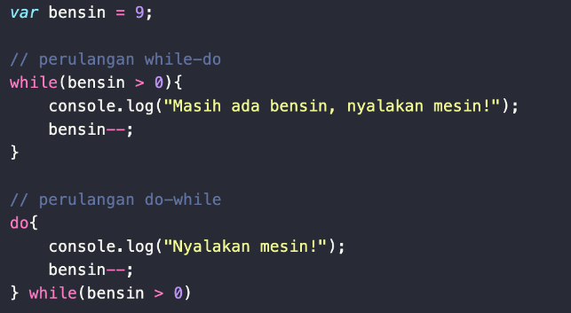
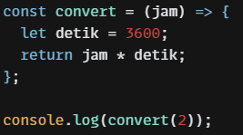

# **JS DASAR – INTRO JAVASCRIPT**
Js atau javascript merupakan bahasa pemrograman yang digunakan sebagai logic pada sebuah website, dimana pada html seperti yang di ketahui merupakan kerangka yang membangun sebuah web, css adalah baju atau tampilan, maka di js merupakan ekspresi atau sifat yang dapat diberikan oleh web tersebut agar menjadi lebih interaktif dan dinamis.

Js dapat dijalankan pada beberapa browser yang telah mensupport seperti dibawah ini:<br>
, 
  
## **Syntax dan Statement**
Syntax pada js dapat dikatakan sebagai kamus, kosa kata dan (grammar) atau disebut juga sebagai tata cara penulisan pada bahasa pemrograman. Kemudian statement merupakan instruksi yang akan dijalankan oleh program komputer 
<br>
**Contoh :** 
 var nilai1=120; // benar 

## **Consol.log** 
Merupakan merupakan code yang digunakan untuk menampilkan teks atau content ke console javasccript. Console.log juga dapat digunakan untuk melakukan debugging atau error pada code.

## **Comment**
Merupaka sintaks yang digunakan untuk memberikan sebuah keterangan atau informasi mengenai code yang ditulis. Comment tidak akan di baca oleh program karena berfungsi sebagai note atau keterangan yang hanya di baca oleh sesame programmer<br>
**Single Comment**

 
**Multi Comment**
 

## **Type Data** 
Merupakan jenis-jenis data yang digunakan dan disimpan di dalam variabel dalam pemrograman.<br>

**Jenis-jenis tipe data :** <br>

Primitive<br>
-	Number	 : tipe data yang mengandung angka 
-	String		: tipe data karakter yang ada pada keyboard, letters,number, sumbol dll. Harus diawali dengan “ ”
-	Boolean : tipe data yg memiliki dua buah nilai yaitu true or false
-	Null		: tipe data yang kosong / tidak memiliiki nilai
-	Undefined	: tipe data yang mengindikasikan tidak ada nilai(tidak ditemukan)

Non primitive:
-	Object		: tipe data yang dapat berisikan tipe-tipe data lain
-	Array		: merupakan jenis objek berbentuk daftar yang digunakan untuk menyimpan beberapa nilai, tanpa properti seperti objek.


## **Variabel**
Merupakan tempat menyimpan value atau nilai yang di deklarasikan.

**3 cara mendifiniskan variable** <br>
Var : data dapat diubah<br>
 

Let : data dapat diubah<br> 
 
  
Cons : data tidak dapat diubah<br>

 

## **Operator js**	
- Assignment Operator 	: (=)
- Arithmetic Operator	: Tambah (+), Kuramg (-), Perkalian (*), - Pembagian (/), Modulus (%)
- comparison operator	: Lebih kecil dari : <. Lebih besar dari: > Lebih kecil atau sama dengan: <= Lebih besar atau sama dengan: >=, Sama dengan: ===, Tidak sama dengan: !==
- Logical Operator	: AND operator : &&, OR operator: ||, NOT operator: !

## **Conditional**
Conditional dapat dikatakan sebagai percabangan pada js yang menggambarkan suatu kondisi atau biasa disebut dengan conditional statement. Pada conditional statement kondisi yang di cek adalah kondisi true. Jika kondisi true memenuhi maka program dijalankan.<br>
Contoh:

 
 **If else statement :** digunakan jika memliki berbagai kondisi

## **Switch Conditional**
Merupakan kondisi yang digunakan jika kondisi dan percabangan yang dibutuhkan lebih banyak.<br>
Contoh:<br>

 

## **Looping**
Merupakan perulangan pada js yang biasanya digunakan untuk melakukan suatu tugas berulang kali hingga statement atau kondisinya terpenuhi. 

### **Jenis-jenis loop**
**For loop** <br>
FOR LOOP jika kita tahu seberapa banyak nilai pasti untuk pengulangannya<br>

 
**While loop** <br>
WHILE LOOP akan menjalankan instruksi pengulangan kondisi bernilai TRUE. Perulangan ini digunakan bila jumlah perulangannya belum diketahui.<br>

 
**Do while** <br>
Pada do while akan melakukan perulangan terlebih dahulu, kemudian cek kondisinya<br>


**Nested loop** <br>
Looping pertama dianalogikan sebagai baris.
Looping kedua dianalogikan sebagai <br>
 


## **JS SCOPE**
Adalah cakupan atau wilayah sebuah program pada bahasa pemrograman js. Penggunaan scope dapat menentukan apakah program dapat diakses pada scope tertentu atau tidak <br>

**Jenis-jenis scope :** <br>
**Global :** Variabel dapat diakses dan dipanggil dimanapun dan harus di deklarasikan diluar block{}<br>
Contoh :<br>


  
**Local :** Variabel hanya dapat diakses di dalam block saja karena bersifat local dan tidak bias diakses diluar block<br>
Contoh:<br>

 
## **Function**
Merupakan sebuah kode program yang digunakan untuk menyelesaikan permasalahan atau tugas tertentu. Function dijalankan ketika dipanggil.<br>
 

## **Parameter** 
Merupakan sebuah data inputan pada function yang digunakan untuk mengerjakan task pada function<br>
 

## **Argumen** 
Merupakan nilai yang digunakan ketika memanggil nilai dan argument harus berjumlah sama dengan parameternya
 

## **Arrow Function**
Merupakan function terbaru dari versi js ES6<br>
 

## **Dom Manipulation**
Merupakan cara js memanipulasi, melihat dan mengakses suatu halaman html. Pada dom setiap elemen yang ada pada html dipandang sebagai objet.

Penulisan atau penggunaan DOM diawali dengan document<br>
Mencari element html dengan DOM selector :<br>
-	Selector mengambil class<br>```
document.getElementsByClassName("nama_class_html");```
-	Selector mengambil ID<br>```
document.getElementById("nama_ID");```
-	Query Selector<br>```
Document.querySelector(“ ”)
Document.querySelectorAll(“ ”)```

2 cara mengubah konten element html :<br>
-	Element.textContent 	: mengubah konten html<br>
Contoh:<br>```
let ganti = document.getElementById("nama_id");
ganti.textContent = "Aku suka Javascript";```

-	Element.innerHTML	: mengubah konten html serta mampu memanipulasi tag html di dalamnya<br>
Contoh :<br>```
let ganti = document.getElementById("nama_id");
ganti.innerHTML = "<p>Aku suka Javascript</p>";```


## **Dom Event**
Pada js event merupakan suatu interaksi atau kejadian yang terjadi pada halaman website. Untuk menghandle  sebuah event perlu memanggil method addEventListerner().addEventListerner() merupakan method yang terdapat pada object DOM. Object ini mewakili sebuah elemen HTML di Javascript<br>
 

## **Macam-macam Event :**
-	onclick = adalah event jika sebuah element html di klik.
-	onchange = adalah event jika sebuah element html berubah.
-	onmouseover = adalah event jika sebuah element html di letakkan cursor mouse.
-	onmouseout = adalah event jika saat cursor mouse meninggalkan element html.
-	onkeydown = adalah event jika saat di terjadi pengetikan pada elemnet html.
-	onload = adalah event ketika jika saat element atau halaman di buka.

