# **Javascript Intermediate**
 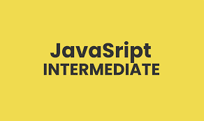

## **Array**
Merupakan sebuah tipe data berupa list order yang mampu menyimpan beragam tipe data. Array dapat menyimpan tipe data berupa String, Number, Boolean dll.<br>
 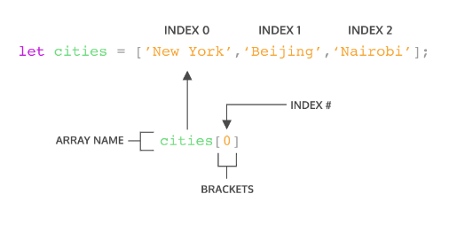

Cara membuat dan memanggil Array:<br>
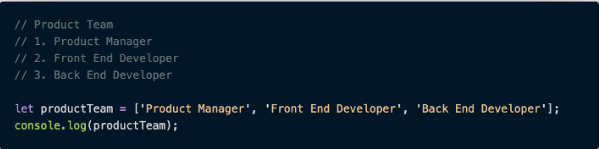<br>
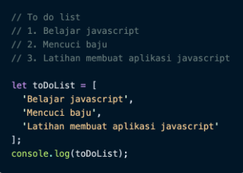<br>
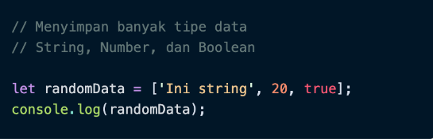<br>
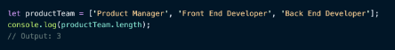

## **Array Method**
-	.push()
untuk menambahkan elemen dari array<br>
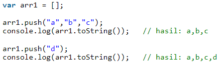
 
-	.pop()
untuk mengurangi elemen dari array<br>
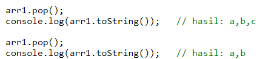
 
-	.unshift()
Digunakan menghapus elemen array di awal array<br>
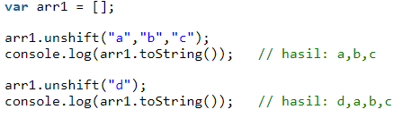
 
-	.shift()
Digunakan untuk menambahkan elemen array di awal array<br>
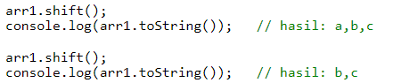
 
-	.sort
Digunakan untuk mengurutkan elemen dari array.<br>
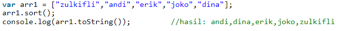
 

Looping Array
-	map()
map() melakukan perulangan/looping dengan membuat array baru.<br>
 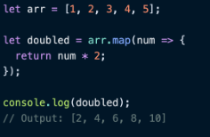

-	foreach
forEach() adalah method untuk melakukan looping pada setiap elemen array<br>
 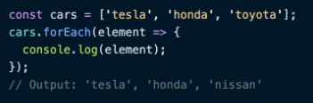


## **Multidimensional Array**
Multidimensional array merupakan sebuah array di dalam array<br>
 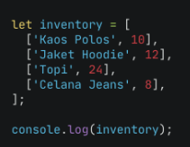
 

## **Method Multidimensional Array**
Pada multidimensional array juga memiliki method built in yang sama juga seperti array sebelumnya yaitu push(), pop(), shift(), unshift(), sort().
Contoh:<br>
 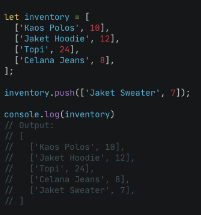

## **Looping Multidimensional Array**
Multidimensional array juga dapat melakukan perulangan seperti array pada umunya dengan method map dan foreach.<br>
-	Map()<br>
 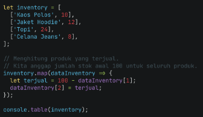<br>
 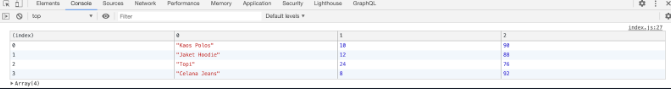

-	Foreach()<br>
 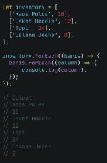

-	For loop<br>
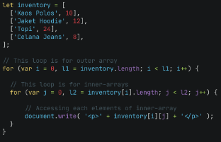
 

## **Object**
Object adalah sebuah variable yang menyimpan nilai(properti) dan fungsi(method)

Contoh object<br>
 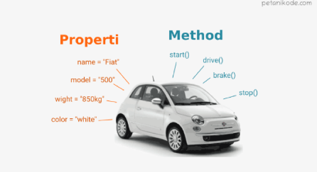

## **Cara membuat sebuah object:**
-	Membuat dan memanggil object<br>
    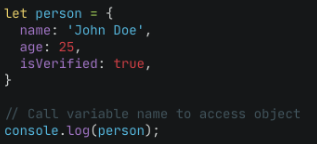
    
-	Memanggil property dalam object<br>
    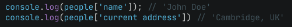

 
 

## **Update and delete Object**
-	Object dapat mengupdate value dari key yang sudah tersedia<br>
 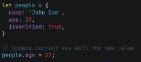

-	Object dapat menambahkan key dan value baru<br>
 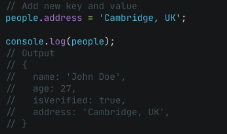

-	Delete Object<br>
 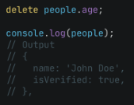


## **Method**
Value pada property berupa function dapat disebut juga sebagai method.

```
Contoh:
Consol.log
Console adalah global javascript object
Log() adalah property yang berupa function dari object console.
```
## **Nested Object**
Object yang berasal dari turunan object lainnya atau objek di dalam objek.<br>
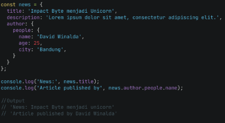

## **Pass by Reference**
Mengubah data pada sebuah object melalui function dengan cara memasukkan object sebagai parameter function.<br>
 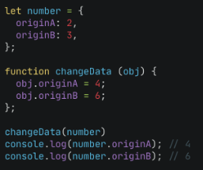

## **Looping Object**
 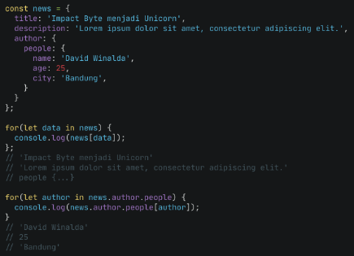

## **Looping array of object**
Arrayof object merupakan object berbentuk array yaitu dapat menyimpan lebih dari satu data.<br>
 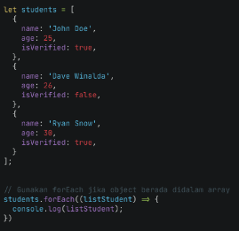<br>
 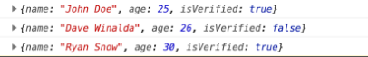
 


## **Recursive**
Merupakan function yang memanggil dirinya sendiri hingga mencapai suatu kondisi tertentu. Biasanya digunakan pada case matematika, fisika, kimia dan yang berhubungan dengan calculation


## **Ciri-ciri rekursive**
-	Memiliki kondisi yang menyatakan kapan fungsi tersebut akan berhenti.
-	Fungsi rekursif selalu memanggil dirinya sendiri sambil mengurangi atau memecahkan data masukan setiap panggilannya.<br>
Contoh kasus rekurisive
 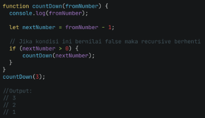

## **REGEX**
Regex adalah singkatan dari Regular Expresion.
Regex merupakan sebuah teks (string) yang mendefinisikan sebuah pattern/pola untuk pencarian sehingga dapat membantu kita untuk melakukan matching (pencocokan), locate (pencarian), dan manipulasi teks.<br>
 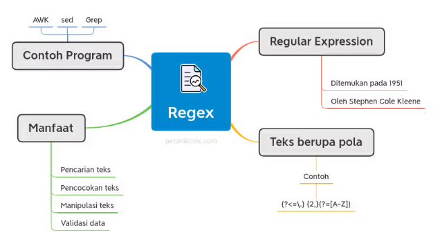


## **Berikut ini beberapa contoh pemanfaatan regex dalam pemrograman:**
1.	Regex untuk Validasi Data
Digunakan untuk matching atau pencocokan teks.
2.	Regex untuk Pencarian
penerapan regex untuk pencarian sebenarnya hampir sama dengan validasi data. Pola regex dimasukan dalam kata kunci, lalu dicocokan dengan database atau teks.
3.	Regex untuk Find and Replace
untuk mengelola teks dan konten lebih efisien.

## **Contoh kasus REGEX**
-	Validasi input dari sebuah FORM
-	Mencari keyword tertentu pada email atau halaman web
-	Mencari IP address dalam kisaran tertentu
-	Dan masih banyak lagi

## **Regex Method**
-	Test()
test() mengembalikan nilai BOOLEAN (TRUE/FALSE) untuk kecocokan sebuat text yang dicari.<br>
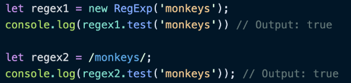 
 
-	Match()
match() mengembalikan nilai array dari karakter yang match.<br>
 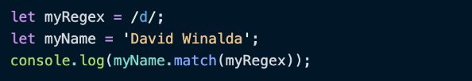<br>
 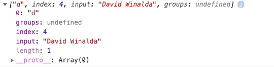
 

## **Flags regex**
flags	Keterangan
- g = Global Search
- i	= Case Sensitive
- m	= Multiline
- s	= Allow . character
- u	= Unicode Support
- y	= Sticky Search

## **Javascriot Object Oriented (OOP)**
Merupakan metode pemrograman yang berorientasi kepada objek. Tujuan dari OOP untuk mempermudah dalam pengembangan program dengan cara mengikuti model yang telah ada di kehidupan sehari-hari.

## **4 Pilar pada OOP:**
1.	Encapsulation
Membatasi akses ke property atau method dari sebuah objek.<br>
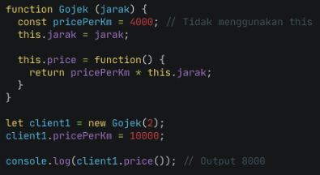
 
2.	Inheritance
Mewariskan property dan methodnya ke dalam class lain atau childnya(turunan).<br>
 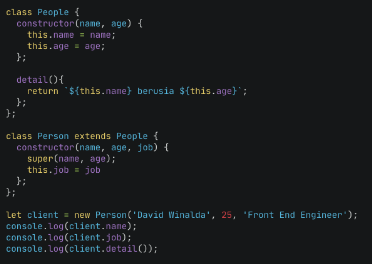

3.	Polymorpishm
Polymorphism adalah kemampuan untuk membuat variabel, fungsi, atau objek yang memiliki banyak bentuk.<br>
 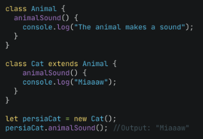

4.	Abstraction
Menyumbunyikan detail tertentu dari sebuah objek dan menampilkan fungsionalitas atau fitur penting dari  objek tersebut.<br>
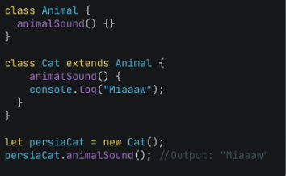
 


## **Javascript Module**
Merupakan sebuah file-file Javascript yang di dalamnya terdapat value dari objects, functions, dan variables. Kemudian file tersebut dapat diexport dan diimport oleh file lain
-	export : kata kunci variabel label dan fungsi yang bisa diakses diluar modul saat ini.
-	import : memperbolehkan impor fungsi dari modul lain.

## **Manfaat module js:**
-	Mudah menemukan dan mengatasi debug pada program
-	Membuat program menjadi component-component kecil
-	Reusable code

Contoh cara export pada file greetings.js<br>
 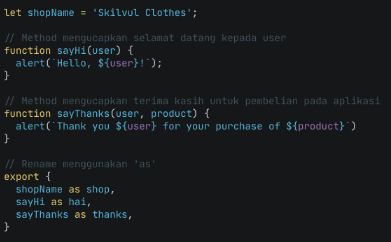

Contoh import pada file index.js<br>
 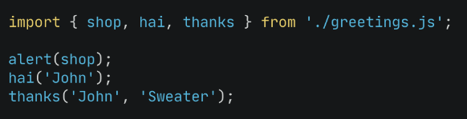

## **Web Storage**
Web storage adalah salah satu Web API yang dapat menyimpan data secara lokal pada sisi client. data yang disimpan pada Web Storage akan bertahan lebih lama karena data akan disimpan pada storage browser
Tipe Web StorageWeb API menyediakan dua tipe Web Storage untuk kita gunakan, yakni sessionStorage dan localStorage

## **Tipe web Storage yang umum digunakan oleh front end**
-	Local storage, 
Local Storage adalah jenis penyimpanan web yang memungkinkan situs dan aplikasi menyimpan dan mengakses data langsung di browser tanpa tanggalmasa berlaku atau kedaluwarsa.<br>
 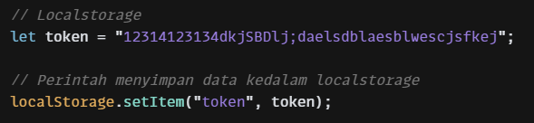<br>
 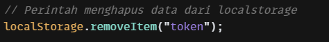
-	session storage.

Session Storage adalah penyimpanan website pada sisi klien yang digunakan untuk menyimpan data selama web-browser atau tab yang memuat halaman suatu website belum ditutup atau keluar (close).<br>
 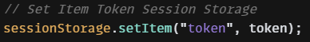<br>
  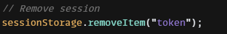
 
## **Tipe web Storage yang umum digunakan oleh back end**
-	cookies
Cookie adalah sebagin kecil dari data yang dikirim dari sebuah situs web dan disimpan dalam komputer pengguna oleh web browser ketika pengguna tersebut sedang membuka halaman dari suatu webiste tertentu.

## **Asynchronous**
Asynchronous adalah proses jalannya program bisa dilakukan secara bersamaan tanpa harus menunggu proses antrian. Synchronous merupakan bagian dari Asynchronous (1 antrian) dimana proses akan dieksekusi secara bersamaan dan untuk hasil tergantung lama proses suatu fungsi synchronous

## **Promise**
Promise bisa dikatakan sebagai object yang menyimpan hasil dari sebuah operasi asynchronous baik itu hasil yang diinginkan (resolved value) atau alasan kenapa operasi itu gagal (failure reason).<br>
  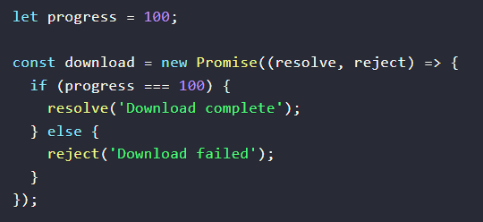

## **Await**
Digunakan untuk menghandle operasi asynchronous dengan syntax yang lebih mirip dengan synchronous. Async/Await sendiri dibuat di atas Promise.<br>
  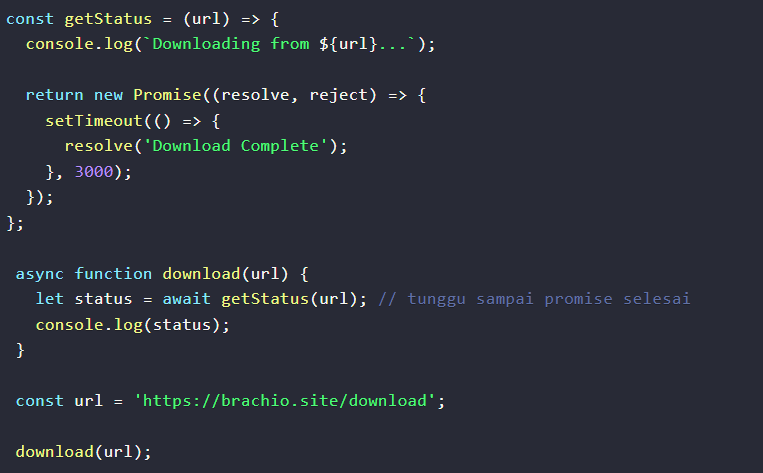

## **Fetch**
Fetch pada Javascript adalah kegiatan untuk meminta/me-request layanan ke endpoint pada website lain atau website sendiri, untuk mengambil response resource / sumber daya berupa data berformat json yang biasa dilakukan programmer untuk membangun website yang membutuhkan data dari website lain<br>
  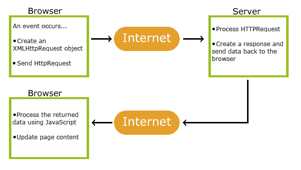
Contoh:<br>
  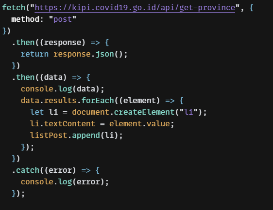<br>
   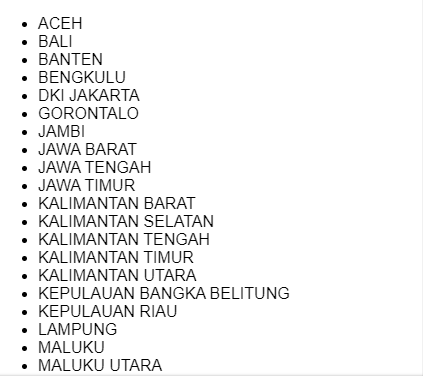
 
