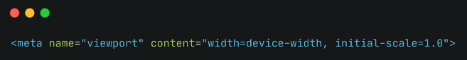
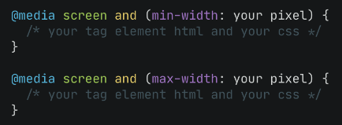

## **Responsive Web**
Responsive web design adalah sebuah teknik atau metode bagi web designer untuk membuat suatu layout website yang dapat menyesuaikan diri sesuai dengan ukuran layar pengguna.
Add viewport 
Merupakan element html yang wajib ada untuk membuat mobile responsive 
  

Anda perlu menambahkan kode CSS berikut agar ukuran gambar tidak melebihi atau kurang dari layar pengguna. 
`img { max-width: 100%; height: auto; }`

**Jenis Media Query:** 
  

## **Bootsrap**
Bootstrap adalah open source front-end development framework yang digunakan untuk pembuatan situs web dan aplikasi web. Dirancang untuk pengembangan web yang responsif untuk mobile design, Bootstrap menyediakan kumpulan sintaks untuk desain template.

**Cara menggunakan bootstrap :**
-	Menggunakan CDN;
-	Download secara manual;
-	Download dengan package manager;
-	npm install bootstrap@next

## **Layouting Bootstrap**
-	Class Container 
Container adalah fondasi dasar dari blok layout. Container berfungsi untuk membungkus blok di dalamnya
-	Class row dan col 
Class row dan col merupakan class untuk membuat baris dan kolom. Kedua class ini lah yang kita gunakan untuk membuat grid.
