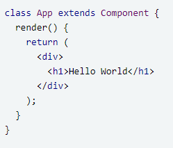

# **React JS Dasar**

## **React JS**
Merupakan framework view library js yang digunakan untuk membuat tampilan pada website. Dalam membuat aplikasi front end React Js lebih cepat walaupun harus menghandle berbagai data.

## **Tipe Extensi FILE React JS**
JSX adalah ekstensi React untuk Javasript. JSX merupakan singkatan dari JavaScript Syntax Extension. Jsx digunakan untuk membungkus js dan memudahkan dalam menyusun elemen pada komponen react

## **Component React Js**
Merupakan bit code yang reusable atau dapat digunakan kembali

## **Aturan dalam membuat component**
Nama folder, file dan function componen harus menggunakan huruf besar diawal dan kata selanjutnya

## **2 cara membuat component:**
-	Menggunakan class component 
    
-	Menggunakan Function Component 
    
 

## **Prop**
Props merupakan argumen yang di-passing dari satu komponen ke komponen lain. Cara passing props sangatlah mudah, yaitu dengan menulisnya sebagai atribut pada elemen HTML. Props digunakan untuk melakukan komunikasi data antara komponen parent dan child. Berikut contoh props. 
 

## **State**
State adalah sebuah object untuk menyimpan data pada React dan akan di render atau muat ulang ketika data mengalami perubahan.
  

