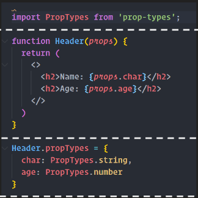
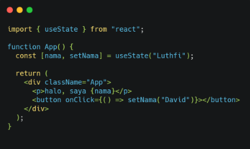
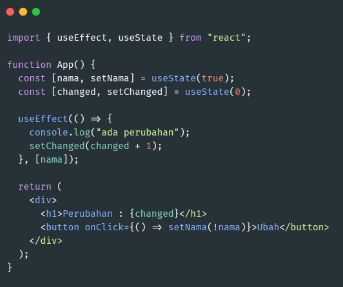
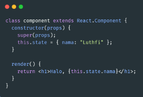
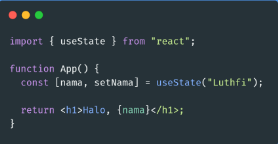

# **React JS Lanjutan**

## **React JS Hook**
Hook digunakan untuk memudahkan penggunaan functional components agar bisa menggunakan state, dan lifecycle dimana pada dasarnya state dan lifecycle hanya bisa di gunakan di class component.

**Penggunaak hook:**
-	useState
-	useEffect

## **Props Types**
Prop Types merupakan lib yang berfungsi untuk memeriksa data prop

**Cara penggunaan props Type** 
 
-	Import propTypes
-	Prop yang akan dikirim harus sesuai dengan tipe data yang dibuat

**Cara penggunaan useState** 
 
-	import useState from react
-	membuat useState Hook
-	memanggil data
-	update state

**cara penggunaan useEffect** 
 
-	import useEffect
-	tuliskan penggunaan useEffect hook sebelum render

**Perbedaan clas component danfunctional componen** 
     
**Class Component :**
-	setState
-	component didupdate
-	component didmount

**functional component**
-	useState
-	useEffect

## **React Router** 
React router merupakan library yang digunakan untuk mengatur dan menentukan arah rute dalam aplikasi.

**Ada dua jenis komponen router:** 
- `<BrowserRouter>`: Ini digunakan untuk menangani URL dinamis.
- `<HashRouter>`: Ini digunakan untuk menangani permintaan statis.

**Instalasi lib react:** 
npm install react-router-dom@6

**Component React Router**
-	`<Link>`
-	`<Routes>`
-	`<Route>`
-	`<Navigate>`
-	`<Navlink>`

## **React Redux**
Redux merupakan state management yang digunakan untuk melakukan lintas komponen

**Instalasi redux**
npm install redux react-redux

**Terdapat 3 poin penting dalam redux :**
- Action 
Action sendiri merupakan suatu event, di mana ia adalah satu-satunya cara Anda dapat mengirim data dari aplikasi Anda ke Redux Store
- Reducer 
Reducer adalah fungsi murni yang mengambil status aplikasi saat ini. Reducer juga berfungsi untuk melakukan tindakan,dan mengembalikan status baru (new state)
- Store 
Store berfungsi untuk menyimpan status aplikasi. Sangat disarankan untuk hanya menyimpan satu store di aplikasi Redux apa pun

