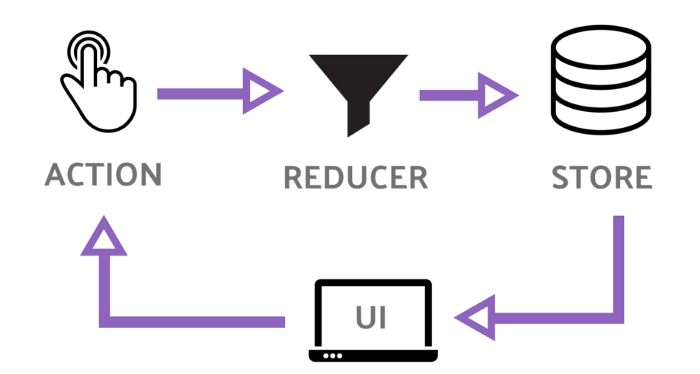

# **React JS Statement Management**

## **Statement Management**
State management adalah sebuah cara untuk mengatur data / state kita bekerja, bisa juga untuk memisahkan antara logic dan view, dimana logic tersebut juga bisa reusable. Terdapat 2 cara dalam melakukan state management: Redux dan UseContext

## **Redux**
Redux merupakan state management yang digunakan untuk mengubah state menjadi global state, sehingga state dapat di digunakan ke komponen lain.
  
**Redux itu memiliki 3 poin penting, yaitu:**
-	Action : Adalah sebuah function yang mereturn sebuah objek. Objek tersebut memiliki sebuah property wajib yaitu type. Type inilah yang menentukan bagaimana statenya akan diubah.
-	Reducer : Adalah sebuah fungsi yang tugasnya untuk mengolah state yang ada di store. Misal menambah data, menghapus data, mengambil data, dsb. Ada 2 parameter wajib dari reducer, yaitu state dan action.
-	Store : Store adalah tempat untuk menampung state.

## **Context**
Context hampir sama dengan redux namun dengan cara yg lebih simplex, UseContext juga dikatakan sebagai general store dimana data dapat digunakan di berbagai komponen, tanpa harus menjadikan data sebagai props di setiap komponennya.

## **React Testing**
Testing merupakan suatu cara untuk melakukan tes komponen pada react. Untuk melakukan testing dapat menggunakan framework javascript berupa jest.

## **Unit Testing**
Unit testing adalah sebuah pekerjaan untuk melakukan pengujian pada suatu bagian pada aplikasi yang telah buat. Tujuan dari unit testing sendiri yaitu untuk melakukan validasi setiap unit pada kode aplikasi agar berfungsi seperti yang diharapkan.

Unit testing memiliki tiga teknik yang disebut black box testing, white box testing dan gray box testing.
1.	Black Box Testing
Black box testing adalah sebuah pengujian yang tidak perlu melihat dan memahami suatu software lebih dalam, pengujiannya melalui user interface, input dan output
2.	White Box Testing
White box testing bersifat transparan jadi kita bisa melihat suatu sistem dari awal sampai akhir untuk dilakukan testing. Untuk testingnya dilakukan untuk menguji struktur internal, desain, fungsi dan detail implementasi dari sebuah aplikasi
3.	Grey Box Testing
Grey box testing ini merupakan sebuah perpaduan antara black box testing dan white box  testing. Pengujiannya ini digunakan untuk eksekusi test, resiko dan metode penilaian

